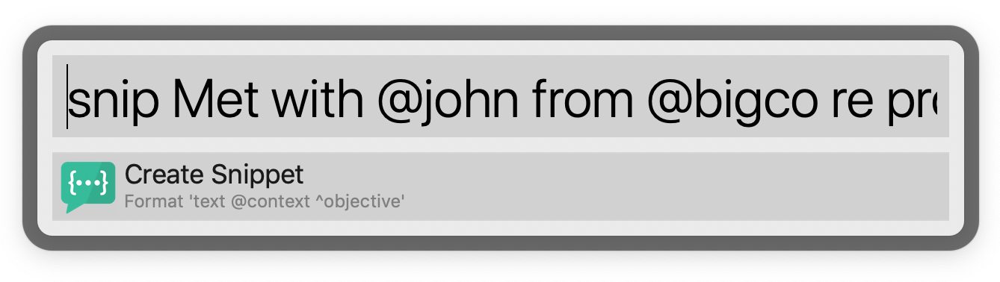

# snip

In most companies people set objectives and define some kind of results that will indicate progress towards achieve that objective ([OKRs](https://en.wikipedia.org/wiki/OKR)). Most of the time, people working on these key results will provided periodic reports (snippets), on their activities towards each objective. This utility is meant to simplify the recording and reporting of these "snippets".

> snip follows the [Howardism principle](http://www.howardism.org/Taoism/Do_Without_Doing.html), "Do Without Doing". Switching context is expensive, so `snip` allows you to record your activity as fast as posable and get back to what you were doing

## Usage

`snip` can be used from either commandline, or any other workflow utility that is able to integrate with commandline, like [Alfred](https://www.alfredapp.com/).

### Recording Snippets

#### Commandline

To record snippet from commandline:

```shell
snip add Met with @john from @bigco re project Apollo ^scale
```

#### Alfred

Alfred automatically wires the snip activity, all you have to do is:



> You can import this Alfred workflow from the [snip.alfredworkflow](./workflow/snip.alfredworkflow) directory

### Snippet Data

Whichever way you enter the snippet, the above commandline will automatically be recognized and recorded as:

* `Met with @john from @bigco re project Apollo` as the snippet
* `@bigco` and `@bigco` as the contexts of the above snippet
* `^scale` as the objective to which this activity is aiming to achieve

### Reporting

`snip` stores your snippets in your home directory as a `sqlite` database. To report at any given time on the captured snippets:

```shell
snip list -w 1
```

This will print to console your snippets for the current week (`--week-ofset` or it's shorter version `-w`) indicate the number of weeks in the past (starting with Sunday).

If you want to output to markdown simplify append the file path (`--output` or `-o`)

```shell
snip list -w 1 -o ~/Downloads/snippets.md
```

The result will look something like this:

```shell
# Snippets Since: 2019-09-22

## scale

* 2019-09-28 - Met with @john from @bigco re project Apollo
* 2019-09-29 - did this and that with @person1 in @place1

## new-product

* 2019-09-26 - wrote a document proposal for @July
```

## Install

To install the utility either download the [latest release](https://github.com/mchmarny/snip/releases/latest) and put it or, if you do not have `golang` installed, clone the repo and install it using `go`"

```shell
clone git@github.com:mchmarny/snip.git
cd snip
make install
```


## Disclaimer

This is my personal project and it does not represent my employer. I take no responsibility for issues caused by this code. I do my best to ensure that everything works, but if something goes wrong, my apologies is all you will get.


## License
This software is released under the [Apache v2 License](./LICENSE)